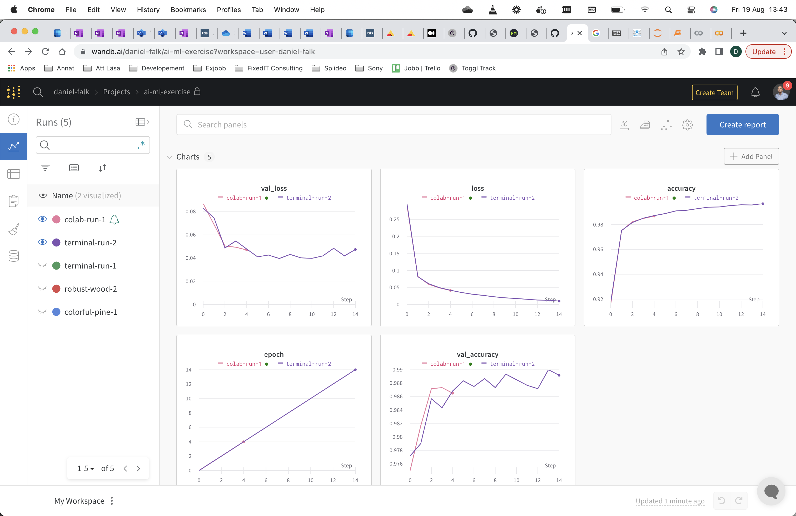
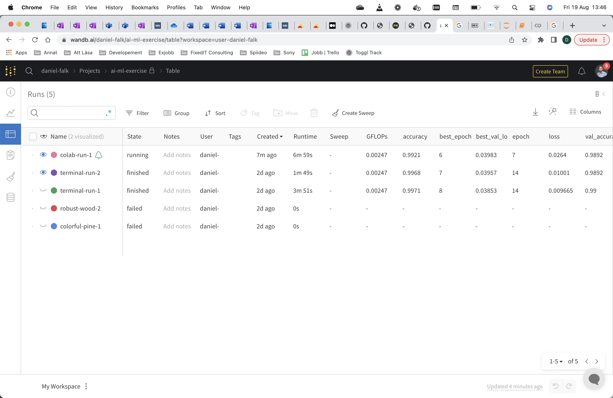
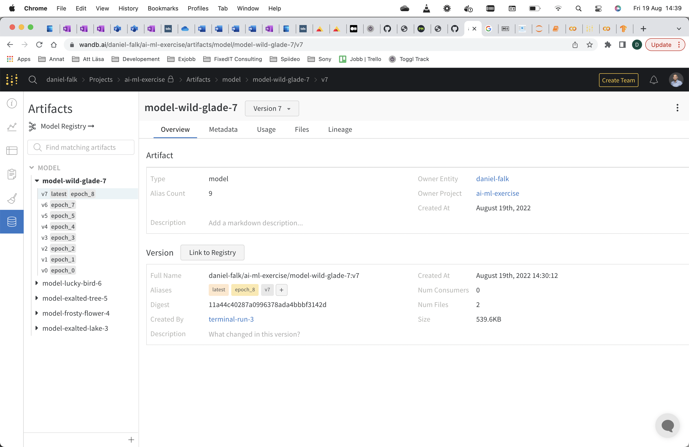

# Logging of ML trainings with Weights and Biases

This exercise require you to have an account on the [*Weights and Biases* website](https://wandb.ai). You can register with your *GitHub* account.

*Weights and Biases* is an hosted platform to log and visualize metrics from Machine Learning training jobs. This is especially useful when you do multiple trainings, testing different ideas, and you need to compare them or take notes on which training was made with what modifications. The tool itself is an online platform but we will use a *python* library `wandb` to upload the metrics and logs to the platform.

## Add WandB logging code
We will modify the training code to log the parameters used for the training and the training result using the `wandb` package.

First we need to import the `wandb` package. Add the following line to the top of the training script:
```
import wandb
```

Next we need to tell the `wandb` library to create a new experiment to keep the information about the current training run. We do that by adding a call to the `init` method as the first line in the `train` function. The method takes a project name as argument, the project name is used to group multiple runs from the same project together. We also gives the function a dictionary called `config`, this is parameters that affects the training that will be logged by *Weights and Biases*.
```
wandb.init(project="ai-ml-exercise", config={"batch_size": batch_size, "epochs": epochs})
```

Finally, the `wandb` library needs to be called during the training to log the progress and metrics. Since the model we are training is using the `Keras` library, we can make use of the `wandb.keras.WandbCallback` class to automatically log a lot of interesting information about our training. In the `model.fit()` call, add the key-value argument `callbacks=[wandb.keras.WandbCallback()]`. The full line should thus be:
```
model.fit(x_train, y_train, batch_size=batch_size,
          epochs=epochs, validation_split=0.1,
          callbacks=[wandb.keras.WandbCallback()])
```

## Run with WandB locally
First install the `wandb` python package:
```
pip install wandb
```

Then use your personal *Weights and Biases* token and run the following command to login. This will configure the `wandb` library so that the logged information will be visible in your *Weights and Biases* account.
```
wandb login
```

We can then run the training, this should create a new training in the list in your *Weights and Biases* account.
```
python train.py
```

## Run in Google Colab
Open [Google Colab](https://colab.research.google.com/) in a new tab. In the explorer window, select GitHub and paste the URL to this GitHub repo. Press the `ML-training/logging-trainings-with-WandB/train.ipynb` link and the code should be opened in a new window. You can now run and/or modify the code directly in the browser.


## Exercises
Decide if you are going to run the code in Google Colab or on your local computer, depending on this you are either going to modify `train.py` if you run the code locally or `train.ipynb` if you run the code in Google Colab. First run the code and make sure that you can train a model with no error messages. When this works, follow the instructions under the *Add WandB logging code* heading to modify the code such that the metrics will be logged to *Weights and Biases*.

### Train a model and look at the logged metrics
Rerun the training code and take a look in the *Weights and Biases* GUI in your browser, there should now be a new project called "*ai-ml-exercise*" with a new run. Look around the GUI and see what information and graphs you can see about the training.

### Train another model and compare the metrics to the first
Rerun the training code again with no modifications. A new run should be found in the *Weights and Biases* GUI. You can compare metrics by selecting the eye icon to the left of the two experiments names in the list. First compare the plotted graphs from the two runs.


You can also compare runs in a tabular form by pressing the "Expand" icon to the right of the "Runs" heading in the project list.


Are the two runs same or different? In case they differ, why do you think they do that?

### Rename the runs to something that describes what you did
You will quickly have multiple runs, some useful and some less useful. By renaming them it is easy to find the ones that are interesting to compare.

First rename the experiment by pressing the three dots to the left of the name, then "rename".

Then write a description about the run by pressing the run name, then pressing the "i" icon on the left side and then pressing the description field.

It could now look something like this:


### Train a few different models with diferent hyperparameters
Change the values for `batch_size` and `epochs` and rerun the training. Use the *Weights and Biases* GUI to compare the different trainings. What are the difference between the models?

When you have decided which model is the best one, use the *Weights and Biases* GUI to download the best model. You can find the saved model by pressing the "Artifacts" icon in the left menu.


## Troubleshooting

`wandb.errors.UsageError: Error communicating with wandb process`:

This is an issue with the `wandb` package and can be resolved by adding either the key-value argument `settings=wandb.Settings(start_method="fork")` or `settings=wandb.Settings(start_method="thread")` to the `wandb.init()` call. Read more on [the official documentation](https://docs.wandb.ai/guides/track/launch).


`TypeError: WandbCallback.set_model() missing 1 required positional argument: 'model'`

You probably forgot to instantiate the WandbCallback class. The object specified in the callbacks list should be instantiated, i.e. `WandbCallback()` (with paranthesis), not `WandbCallback`.
